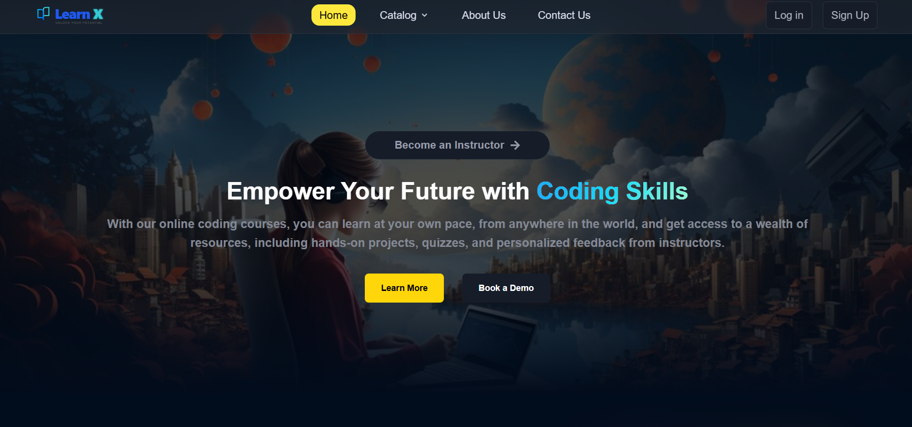
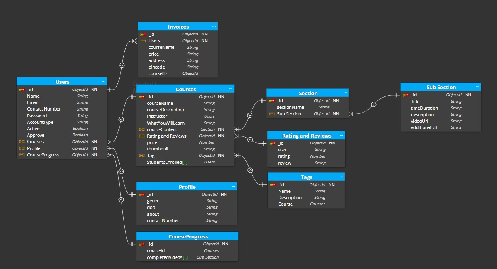
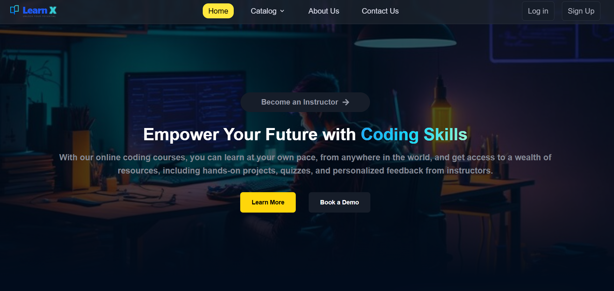
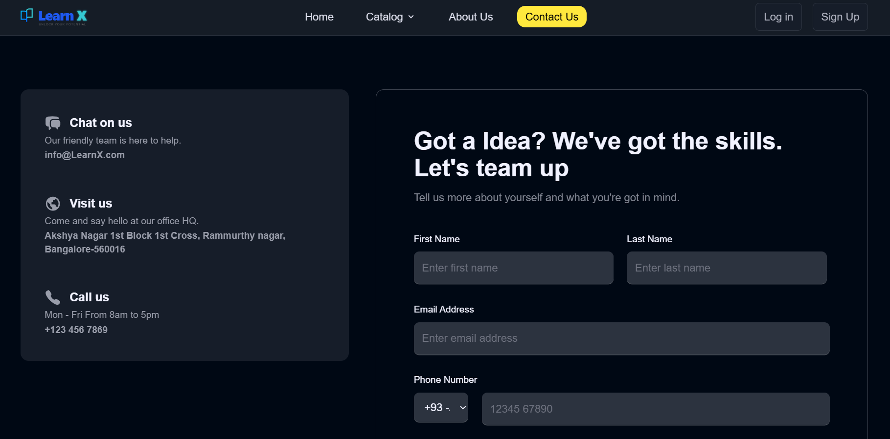
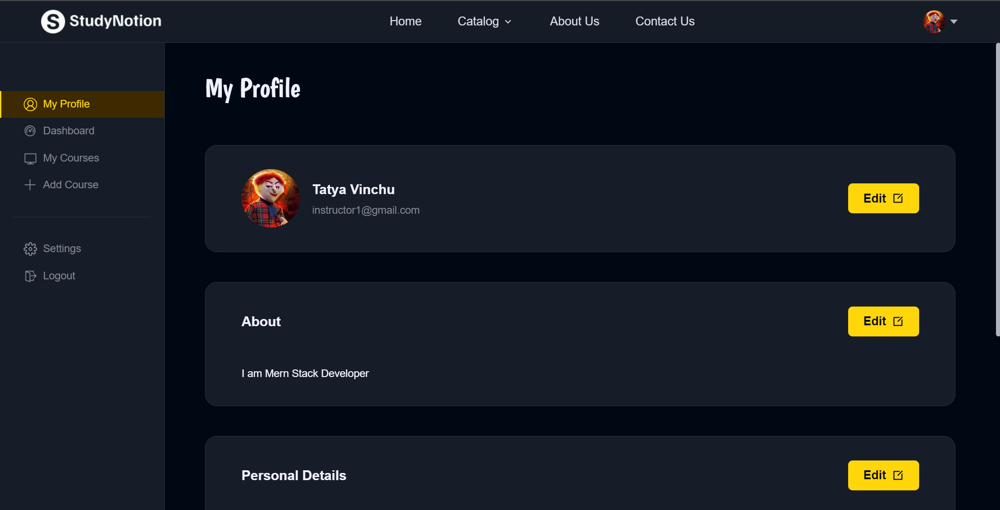
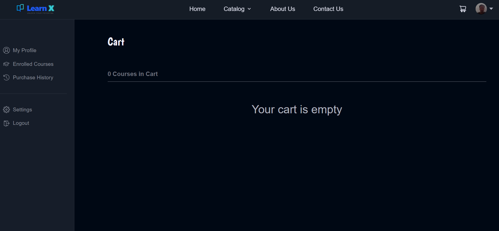
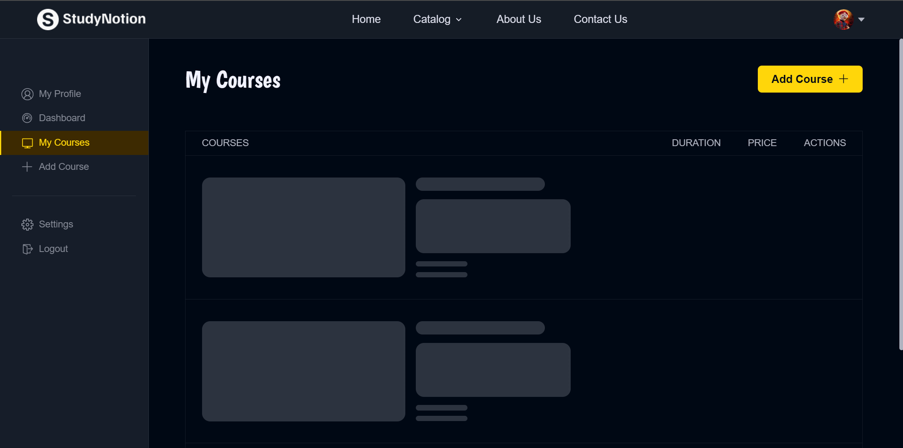
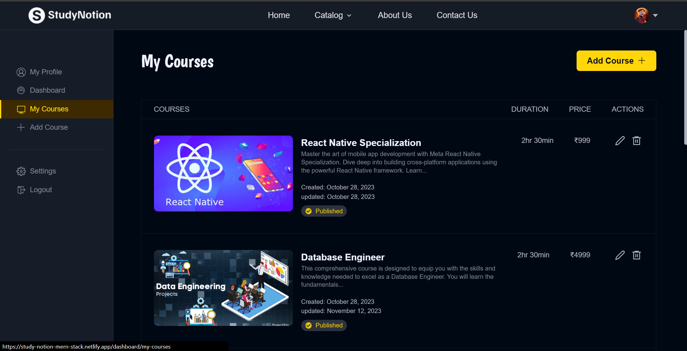
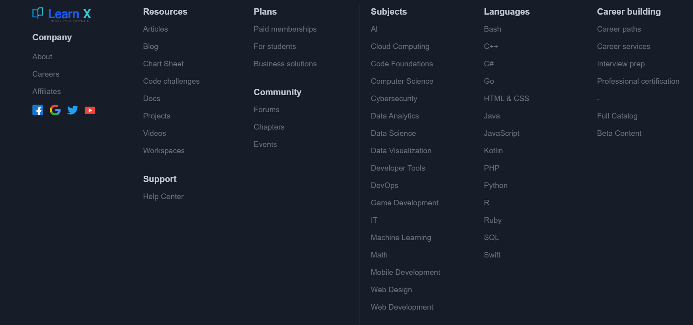

# Project Description 📝
LearnX is a fully functional ed-tech platform that enables users to create, consume, and rate educational content.  
The platform is built using the **MERN stack**, which includes ReactJS, NodeJS, MongoDB, and ExpressJS.

## Table of Contents

| Section                 | Description                                  |
|-------------------------|----------------------------------------------|
| [Learnx Aim](#LearnX-aim-)        | 📚 Overview of Learnx's goals            |
| [Tech Stack](#tech-stack-)             | 💻🔧 Technologies used in the project         |
| [System Architecture](#system-architecture-)    | 🏰 Overview of the system architecture      |
| [Architecture Diagram](#architecture-diagram-)   | 🏗️ Diagram illustrating the architecture   |
| [Schema](#schema-)                  | 🗂 Explanation of data schemas used          |
| [React Hooks](#react-hooks-)            | 🎣 Overview of React Hooks utilized          |
| [React Library](#react-library-)         | ⚛️📚 Overview of React Libraries used        |
| [Screen Preview](#screen-preview-)         | 🖥️ Screen Preview        |

## L Aim 📚 
 
1️⃣ A seamless and interactive learning experience for students, making education more accessible and engaging. 
2️⃣ A platform for instructors to showcase their expertise and connect with learners across the globe. 

 
 

## Tech Stack 💻🔧 

## Frontend 🎨 : 
<code title="React.js"></code>
<code title="Vite"></code>
<code title="Redux.js"></code>
<code title="css"></code>
<code title="Tailwind css"></code>

## Backend ⚙️ :
<code title="Nodejs"></code>
<code title="Express"></code>

## Database 🛢️ :
<code title="Mongodb"></code>

## Cloudinary Integration ☁️
<code title="Mongodb"></code>

## System Architecture 🏰
 
☝ The LearnX ed-tech platform consists of three main components:   
The front end, the back end, and the database. The platform follows a client-server architecture, with the front end serving as the client and the back end and database serving as the server.

🎨 Front-end   
The front end of the platform is built using ReactJS, which is a popular JavaScript library for building user interfaces. ReactJS allows for the creation of dynamic and responsive user interfaces also **Loading Skeleton**, which are critical for providing an engaging learning experience to the students. The front end communicates with the back end using RESTful API calls.

⚙️ Back-end   
The back end of the platform is built using NodeJS and ExpressJS, which are popular frameworks for building scalable and robust server-side applications. The back end provides APIs for the front end to consume, which include functionalities such as user authentication, course creation, and course consumption. The back end also handles the logic for processing and storing the course content and user data.

🛢️ Database   
The database for the platform is built using MongoDB, which is a NoSQL database that provides a flexible and scalable data storage solution. MongoDB allows for the storage of unstructured and semi-structured data, which is useful for storing course content such as videos, images, and PDFs. The database stores the course content, user data, and other relevant information related to the platform.

## Architecture Diagram 🏗️
 
Here is a high-level diagram that illustrates the architecture of the LearnX ed-tech platform:

#### The front end of LearnX has all the necessary pages that an ed-tech platform should have. Some of these pages are: 

For Students:
- **Homepage 🏠:** A brief introduction to the platform with links to the course list and user details and random background.
- **Course List 📚:** A list of all the courses available on the platform, along with their descriptions and ratings.
- **Wishlist 💡:** Displays all the courses that a student has added to their wishlist.
- **Cart Checkout 🛒 :** Allows the user to complete course purchases.
- **Course Content 🎓:** Presents the course content for a particular course, including videos and related material.
- **User Details 👤:** Provides details about the student's account, including their name, email, and other relevant information.
- **User Edit Details ✏️:** Allows students to edit their account details.

For Instructors:
- **Dashboard 📊:** Offers an overview of the instructor's courses, along with ratings and feedback for each course.
- **Insights 📈:** Provides detailed insights into the instructor's courses, including the number of views, clicks, and other relevant metrics.
- **Course Management Pages 🛠️:** Enables instructors to create, update, and delete courses, as well as manage course content and pricing.
- **View and Edit Profile Details 👀:** Allows instructors to view and edit their account details.

### Back-end ⚙️

The back-end of the platform is built using NodeJS and ExpressJS, providing APIs for the front-end to consume. These APIs include functionalities such as user authentication, course creation, and course consumption. The back-end also handles the logic for processing and storing the course content and user data.

#### Back-end Features

- **User Authentication and Authorization 🔐:** Students and instructors can sign up and log in to the platform using their email addresses and passwords. The platform also supports OTP (One-Time Password) verification and forgot password functionality for added security.
- **Course Management 🛠️:** Instructors can create, read, update, and delete courses, as well as manage course content and media. Students can view and rate courses.
- **Payment Integration 💳:** Students will purchase and enroll in courses by completing the checkout flow, followed by Razorpay integration for payment handling.
- **Cloud-based Media Management ☁️ :** LearnX uses Cloudinary, a cloud-based media management service, to store and manage all media content, including images, videos, and documents.
- **Markdown Formatting ✍️:** Course content in document format is stored in Markdown format, allowing for easier display and rendering on the front-end.

#### Data Models and Database Schema

The back-end of LearnX uses several data models and database schemas to manage data, including:

- **Student Schema 🧑‍🎓:** Includes fields such as name, email, password, and course details for each student.
- **Instructor Schema 👩‍🏫:** Includes fields such as name, email, password, and course details for each instructor.
- **Course Schema 📚:** Includes fields such as course name, description, instructor details, and media content.

### Database 🛢️
The database for the platform is built using MongoDB, a NoSQL database that provides a flexible and scalable data storage solution. MongoDB allows for the storage of unstructured and semi-structured data. The database stores the course content, user data, and other relevant information related to the platform.

## Schema 📋

## React Hooks 🎣

Utilized several React hooks for efficient state management and dynamic behavior:

- `useState`
- `useEffect`
- `useDispatch`
- `useParams`
- `useSelector`
- `useLocation`
- `useNavigate`
- `useRef`
- `useForm`
- `useDropzone`
- `Custom-Hook`

 

## 📚 **React Library**:

- 🚀 **Lazy Loading**: Enhance performance by lazily loading images using the react-lazy-load-image library.
- 📊 **Chart.js:**  Versatile charting library for creating interactive and visually appealing charts.
- 🎭**Framer Motion:**  Animation library for React, providing smooth and expressive motion.
- 📁 **React Dropzone:**  Drag-and-drop file uploader for React applications.
- 🍞 **React Hot Toast:**  Elegant and customizable toast notifications for React applications.
- 🔢 **React OTP Input:**  Input component for one-time password entry in React forms.
- 📊 **React Super Responsive Table:**  Highly responsive and feature-rich table component for React.
- 🔄 **Swiper:**  Modern touch slider for mobile and desktop browsers.
- 🖋️ **React Type Animation:**  Simple and configurable typing animation component for React.
- 🎥 **Video React:**  React-based video player for building rich multimedia experiences in web applications.

##  🖥️ Screen Preview :

# Random Home Page Background 🏠 

# About Page

# Contact Page

# Forgot passwornd

# Dashboard

# Edit Profile

# Add Course

# Edit Course

# Course Details 1

# Course Details 2

# Add Review

# Cart1

# Enrolled Courses 1

# Enrolled Courses 2

# Instructor Data 1

# Instructor Data 2

# My Courses 1

# My Courses 2

# View Courses 1

# View Courses 2

# Delete Account

# Footer

 
